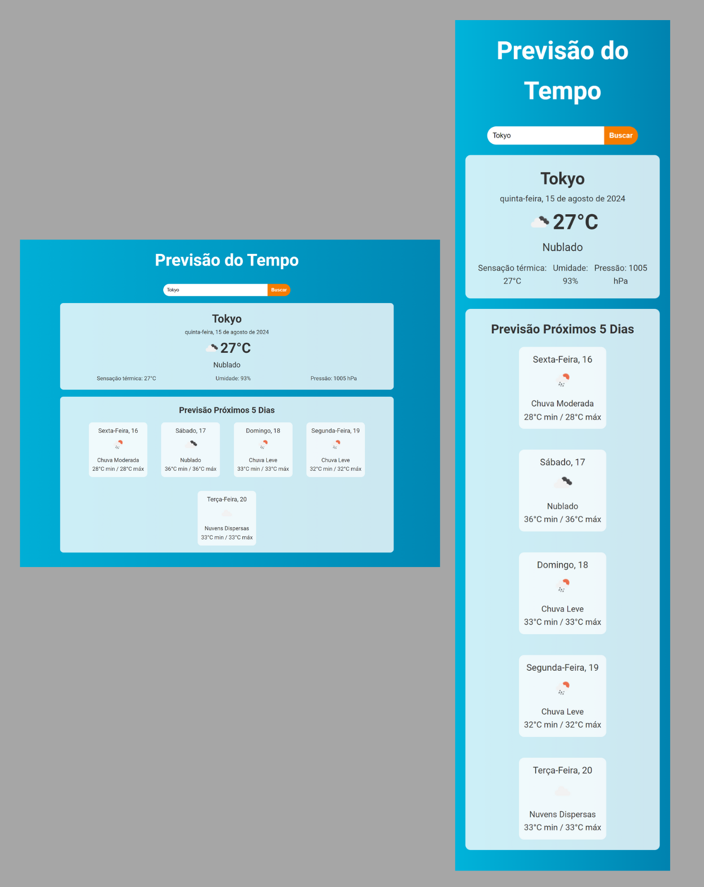

# Previsão do Tempo com React

Neste projeto, desenvolvi uma aplicação de previsão do tempo utilizando:

- React: Para criar a interface dinâmica e responsiva do usuário.

- OpenWeather API: Para obter dados atualizados sobre o clima atual e a previsão dos próximos 5 dias.

- Axios: Para realizar requisições HTTP e interagir com a API.

- CSS: Para estilizar os componentes e garantir uma boa experiência visual.

- Vite: Para um ambiente de desenvolvimento rápido e eficiente.

## 🛠️ Ferramentas usadas
- CSS
- REACT
- VITE